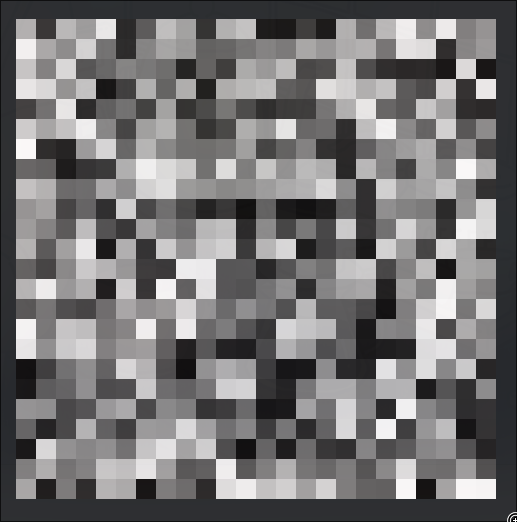
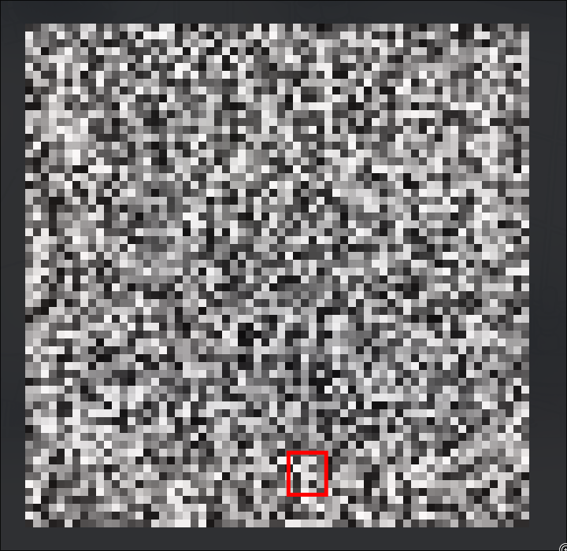

# Witness of Babel

  
   

AKA the art critic of Babel if you are feeling funny. This is an AI made for the sole purpose of sifting through randomly generated images (Canvas of Babel) and trying to find meaning. Inspired by Solar Sands' [Canvas of Babel video](https://www.youtube.com/watch?v=awpVjv2-Ow0) It also explains the concept well if my description isn't enough for you. It is in no way a viable solution to generating images, but I find it very funny and interesting as a concept. If you are intrigued, you can try your luck at finding the next Van Gogh painting on the Canvas of Babel.

If you get dream luck and find an image please send it to me, possibly to put up on this page as an example. Amogus will not be accepted

## Why make this and what's a Babel ? (**I SWEAR THIS IS INTERESTING**)

The concept originates from a short story written by Jorge Luis Borges titled "The Library of Babel". The book is about a hypothetical library containing 410-page books filled with every single possible combination of characters(shush, I know it's less). This means that most of the books are complete gibberish. However, it also means that on the endless shelves, one can find a vivid description of their future wedding, a transcript of their every dream, and a hitlist of everybody on Earth that likes pineapple on Pizza (This README is there too, Hi Babel librarian !). 

This concept was adapted as a website at https://libraryofbabel.info/. If you have some time you are looking to waste you can try to navigate the library consisting of about **10^5000 books**. The website creator also expanded the idea to art with the Canvas of Babel. A set of all 640x416 images using 4096 colors, making **4096^266240 images**. Containing anything from screenshots of every Library of Babel book, to your birth, wedding, and funeral, on top of all yet-to-be-posted memes out there. In my case I decided to limit my Canvas of Babel to 32x32 greyscale images, bringing the number of possible images to a measly **1 × 10^3072**, something sure to disappoint all the immortal fans in the audience. This is what my AI, Witness of Babel, is doomscrolling through for days. 

## How do I try my luck ? (**INSTALLATION**)
You need to have Python installed. Having a GPU is preferable but not completely necessary. Macbook GPUs work too
1. `git clone https://github.com/DvorakDwarf/Witness-of-Babel.git`
2. `cd Witness-of Babel`
3. `python -m pip install -r requirements.txt`
4. There is a regular search script and a search with a discord bot for notifications. If you will use the bot, create a .env file in the src directory. You need to set `CHANNEL_ID`, `USER_ID`, and `TOKEN`. `CHANNEL_ID` is for the channel you want the bot to post in
5. If you wish to train your own model, use main.py
6. `cd src`, `python search.py` or `python bot_search.py` 
7. Wait
8. Collect cool images in logs or discord
9. Great Success

## Details 4 nerds
The AI was trained on [tiny-imagenet](https://www.kaggle.com/datasets/akash2sharma/tiny-imagenet) and the architecture is a painfully shallow CNN. The "Canvas" is a random tensor that predominantly returns white noise and the model looks through all of it and returns anything that looks sensible to it. On my hunk of junk PC, it zoomed through about 70000 64x64 images a second. There isn't really much more to it beyond a cool concept. If you want to be a stickler to the rules, the model is not going frame by frame along the canvas. If you want to put your money where your mouth is, on the other hand, there is functionality to go pixel by pixel and you can implement that if you have unlimited time on your hands.

I tried out encapsulating different parts such as the dataset more by putting constants in them as well. Not worth it.

## Final Comments

It's not against anybody's TOS this time, so that's nice. \
Shoutout to Discord for making projects easier and not yet getting angry over stuff I did \
I implore you to try to improve on this. There are a bunch of ways of going about this.

Do what you want with the code, but credit would be much appreciated and if you have any trouble with the Witness, please contact me over Discord.

